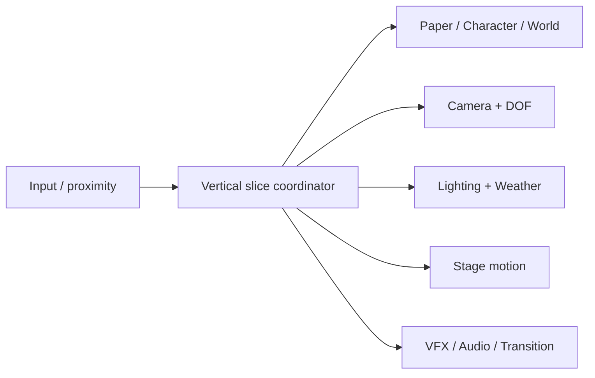

# Architecture

## Core

`core/`はゲームジャンル・デモ進行を知りません。

- `paper/`: `PaperObject3D`を基底に、Billboard / CrossPlane / PaperMesh。通常ノードとしてInspector編集可能な`@tool`。描画用子ノードは再構築できる一時ノードです。
- `paper/PaperEdgeCache`: 画像・色・幅をキーに初回生成を共有。通常は生成済みテクスチャを優先。元PNGへ白フチを上書きしません。
- `character/`: CharacterBody3D移動、足元基準のSpriteSheet、名前付きクリップ、接地影、Footstep信号。Idleは提供歩行画像の1フレームを保持します。
- `world/`: 3D地面・箱・衝突境界・SurfaceMark。地面をDecalだけで構築しません。
- `architecture/`: HouseShellは3Dモデルの差し替え口。`model_scene`にGLB/PackedSceneを入れると仮モデルを置き換えます。GLBの原点・縮尺・コリジョンは利用素材に合わせて調整が必要です。
- `interaction/`: 距離と要求信号のみを扱うProximityInteraction。紙を操作するゲームルールを持ちません。

## Presentation

各Directorは独立したNodeです。互いを取得したり呼び合ったりしません。

|Director|責務 / Resource|
|---|---|
|CameraDirector|位置、回転、FOV、Zoom、Follow、Push In、Shake、Focus Target。CameraProfile|
|DOFDirector|カメラ深度上の焦点・前後のSharp範囲。DOFProfile。焦点移動中も移動後の対象深度を追跡|
|LightingDirector|Base / Local / Dramatic。LightingProfile。イベント照明は屋内外の基準から相対的に減光して復帰|
|WeatherDirector|Clear / Windのみ。WeatherProfile。Paperノードへ共有風量を渡す|
|StageDirector|Rise / Fall / DropFromWire。StageMotionProfile。足元/上端Pivotを使うTween。物理シミュレーションなし|
|VFXDirector|少数のCPUParticles3D、2D PlaneのFlash。水は専用Shader|
|AudioDirector|6つのCue信号と任意のAudioStream辞書。未指定なら信号だけ発行|
|OcclusionDirector|手前のPaperの投影範囲と主人公が重なる場合に透過し、離れたら復帰|
|TransitionDirector|全画面の短いフェードのみ。場所の切替はデモ側|

Profileは通常のResource / `.tres`。イベントTweenは重複時に既存のTweenを止める設計です。Stage motionの同一対象での置換も古いTweenをkillします。イベント中の入力制限はデモ進行側で管理します。

## Demo / Game

`game/vertical_slice.gd`が場面を組み立て、TriggerとInteractionから各Directorを協調させます。`game/demo_profile.tres`はTrigger・歩行速度・待ち時間・ガイド移動先を設定します。`demo/`にはEditor配置用の独立した見本シーンがあります。

重要な区別: Stage Motionは演出です。ProximityInteractionは要求発行です。どちらもInventoryやPaper Puzzle、紙を倒すゲームルールを実装しません。

## Optional / Genre

`optional/paper_gameplay/`は将来の紙世界操作ルール用です。`genres/adv/`, `genres/rpg/`, `genres/action/`はジャンル固有のフロー用です。今回いずれにも実行コードを置いていません。Core/Presentationからの依存もありません。

RPG戦闘、Action戦闘、Quest、Inventory、Save、NPC AI、Snow/Storm、独自画風、Editor Pluginは未実装です。画面表示は操作ガイドと統計だけに限定しています。
