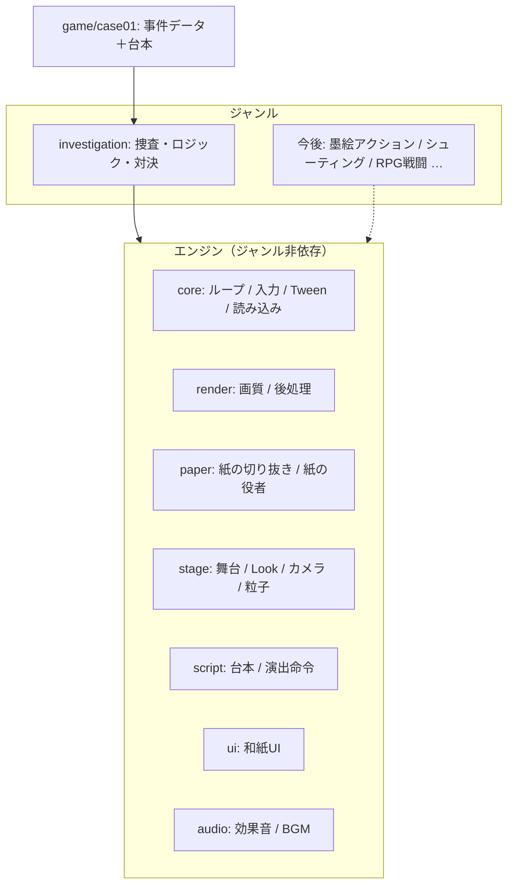

# 設計

## 考え方

「紙の舞台」はジャンルが変わっても同じ。変わるのは **遊び方（モード）** と **見た目のプリセット（Look）** だけ、という分け方をしています。

依存の向きは **ゲーム → ジャンル → エンジン** の一方通行です。エンジンはジャンルやゲームを知りません。

## エンジンの部品

| 部品 | 役割 |
|---|---|
| `Engine` | 描画・時間・入力・音・UI・舞台をまとめ、現在の `Mode` を毎フレーム動かす。タブ非表示で一時停止し、復帰直後に時間が飛ばない |
| `Mode` | ジャンルの遊び方。`enter / update / exit` だけを持つ |
| `PaperSprite` | 紙の切り抜き1枚。ビルボード・十字（木）・床置き（水たまり）・風揺れ・接地影・前景の透過 |
| `PaperActor` | 立ち絵＋目口パーツの役者。まばたき・口パク（テクスチャ再転送なし）、紙の歩き、裏返る振り向き、ジャンプ、床から起き上がる登場 |
| `Stage` | 光（太陽＋空の環境光）、空の一枚絵、霧、床、舞台装置、粒子。`setLook()` で雰囲気を補間して切り替え |
| `Look` | 空・光・霧・色調・ボケの量をまとめたプリセット（`sunset` / `confront` / `dusk`）。墨絵などはここに足す |
| `CameraRig` | 「見る点」と「距離」で構図を決める。追従・寄り・2人の構図・揺れ。被写界深度の焦点距離もここから |
| `PostFX` | 深度付きで描画 → 縮小バッファで2回ぼかす → 深度で合成（被写界深度）＋色調・周辺減光・粒子感・暗転演出 |
| `Director` | 台本を上から実行。命令は `register()` で追加できるので、ジャンル固有の命令も同じ台本に書ける |
| `Hud` | 会話・叫び・字幕・選択肢・アイテム一覧・入手演出・暗転・タッチ操作。状態は持たず表示と入力待ちだけ |

## 逆転検事風ジャンル（`src/genres/investigation`）

- `types.ts` … 事件データの形（登場人物・配置・証拠・手がかり・調べる場所・目的・ロジック・対決・台本）
- `CaseState.ts` … 進行状態（証拠・記録）とロジック判定、対決の状態（表示を持たないのでテストしやすい）
- `InvestigationGame.ts` … 捜査の歩き回り、調べる、ロジック、対決の流れ
- `TestimonyPanel.ts` … 証言パネル

新しい事件は `CaseData` を1つ書くだけで作れます（`src/game/case01/case.ts` が見本）。

## スマホ向けの負荷対策

- 紙の白フチは素材の準備段階で焼き込み、毎フレームの輪郭シェーダーを使わない
- 目口は小さな板の差し替えだけ（立ち絵の大きなテクスチャを再転送しない）
- 被写界深度は縮小バッファ（1/2〜1/3）のぼかしを深度で混ぜるだけ。SSAO/SSR/ブルーム多段は不使用
- 影を落とす光は太陽1つだけ。灯りの点光源は影なし
- 画質プロファイル（low / medium / high）で解像度上限・MSAA・影・ぼかし解像度・粒子数を切り替え
- 素材は WebP、立ち絵は透明余白を切り詰めて縮小（素材合計 約6MB、BGM含む）

## 今後ジャンルを足すときの目安

1. `src/genres/<ジャンル>/` に `Mode` を実装する（例: 墨絵アクションなら当たり判定・攻撃・敵AI）
2. 必要なら `LOOKS` に見た目プリセットを足す（例: `sumi` … 彩度0・紙色の空・墨のにじみ）
3. 台本で使う命令を `director.register()` で足す
4. ゲーム側は `src/game/` にデータと台本を書く

エンジン側に足すのは「どのジャンルでも使うもの」だけ、という線引きを守ります。
